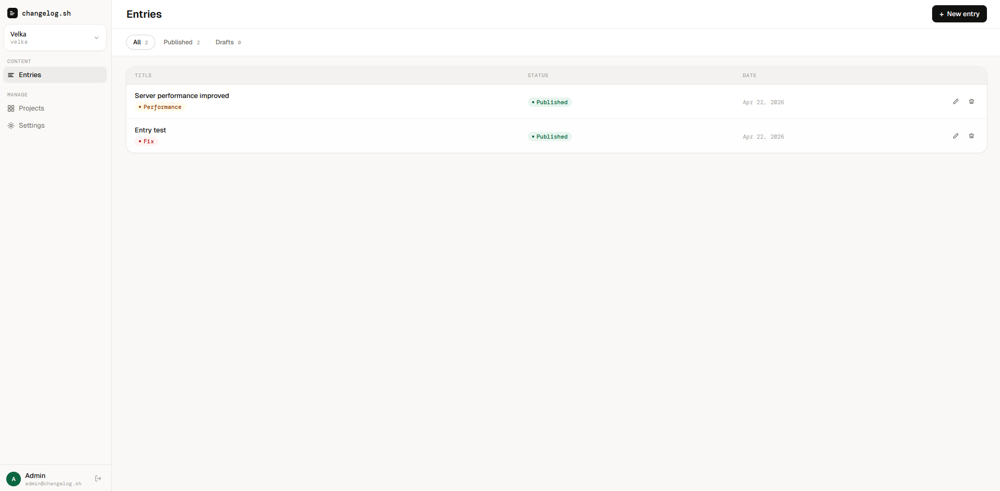
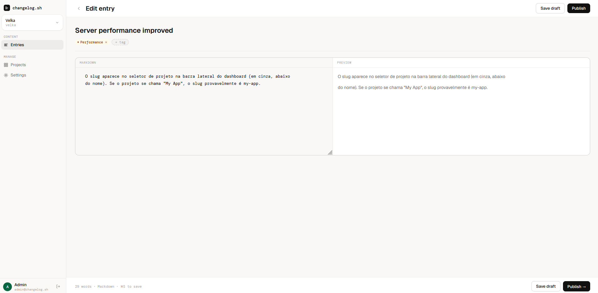
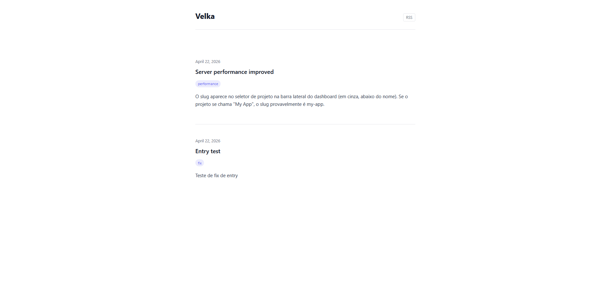
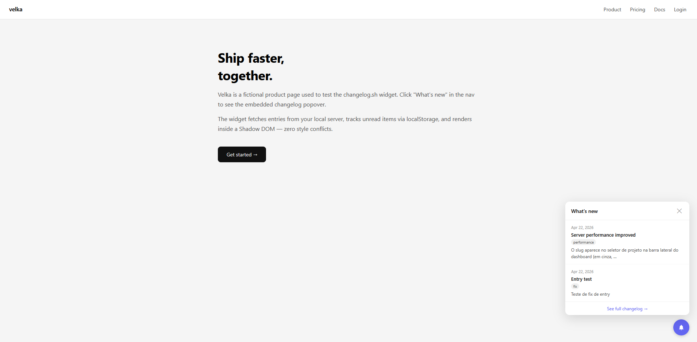

# changelog.sh

Self-hosted changelog platform with an embeddable Web Component widget.

One Docker command to run. One `<script>` tag to embed. No accounts, no vendor lock-in, no $49/month for a markdown renderer.

```bash
docker run -p 3456:3456 -v ./data:/data \
  -e BETTER_AUTH_SECRET=your-32-char-secret \
  -e ADMIN_EMAIL=you@example.com \
  -e ADMIN_PASSWORD=yourpassword \
  ghcr.io/wesllen-lima/changelog-sh:latest
```

Then open `http://localhost:3456` and start publishing.

---

## Screenshots

> Dashboard — entries list with publish/unpublish inline



> Editor — markdown + live preview side by side



> Public changelog — SSR page served to your users



> Widget — embeddable popover with unread badge



_Replace these placeholders: run the server locally, take screenshots, and drop them in `docs/`._

---

## vs Beamer / Headway / Changelogfy

| Feature                | changelog.sh     | Beamer           | Headway          |
| ---------------------- | ---------------- | ---------------- | ---------------- |
| Self-hosted            | ✅ yes           | ❌ SaaS only     | ❌ SaaS only     |
| Free tier              | ✅ forever       | ⚠️ limited       | ⚠️ limited       |
| Embeddable widget      | ✅ Web Component | ✅ yes           | ✅ yes           |
| RSS feed               | ✅ built-in      | ❌ no            | ✅ yes           |
| Magic link login       | ✅ optional      | N/A              | N/A              |
| API key access         | ✅ built-in      | ✅ yes           | ⚠️ paid plan     |
| Your data, your server | ✅ yes           | ❌ their servers | ❌ their servers |
| Docker one-liner       | ✅ yes           | ❌               | ❌               |
| Price                  | **$0**           | $49–$199/mo      | $29–$99/mo       |

---

## What you get

| Surface     | URL                                          | Description                                  |
| ----------- | -------------------------------------------- | -------------------------------------------- |
| Dashboard   | `http://localhost:3456`                      | Admin panel — write, publish, manage entries |
| Public page | `http://localhost:3456/:slug`                | SSR changelog page rendered for your users   |
| RSS feed    | `http://localhost:3456/:slug/rss.xml`        | Feed readers and CI integrations             |
| Widget JS   | `http://localhost:3456/widget.js`            | Embeddable Web Component (<4kb gzipped)      |
| Widget API  | `http://localhost:3456/widget/:slug/entries` | Public JSON used by the widget               |

---

## Embed the widget

Drop two lines into any HTML page:

```html
<script src="https://your-server/widget.js"></script>
<changelog-widget project-id="your-project-slug"></changelog-widget>
```

The widget fetches entries from your server, renders a "What's new" popover, and shows an unread badge via `localStorage`. No external dependencies. Shadow DOM — zero style conflicts.

---

## Deploy with Docker Compose

```bash
curl -O https://raw.githubusercontent.com/wesllen-lima/changelog-sh/main/docker-compose.yml
curl -O https://raw.githubusercontent.com/wesllen-lima/changelog-sh/main/.env.example
cp .env.example .env
# Edit .env — set BETTER_AUTH_SECRET, ADMIN_EMAIL, ADMIN_PASSWORD
docker compose up -d
```

---

## Install binary (no Docker)

```bash
curl -fsSL https://raw.githubusercontent.com/wesllen-lima/changelog-sh/main/install.sh | bash
```

Supports Linux x64, Linux arm64, macOS arm64. Then:

```bash
export BETTER_AUTH_SECRET=$(openssl rand -hex 32)
export ADMIN_EMAIL=admin@example.com
export ADMIN_PASSWORD=yourpassword
changelog
```

---

## Environment variables

| Variable              | Required | Default                    | Description                          |
| --------------------- | -------- | -------------------------- | ------------------------------------ |
| `BETTER_AUTH_SECRET`  | yes      | —                          | 32+ char random string               |
| `ADMIN_EMAIL`         | yes      | —                          | Email for the initial admin account  |
| `ADMIN_PASSWORD`      | yes      | —                          | Min 8 chars                          |
| `PORT`                | no       | `3456`                     | HTTP port                            |
| `DB_PATH`             | no       | `./data/changelog.db`      | SQLite file path                     |
| `ALLOWED_ORIGIN`      | no       | —                          | CORS origin for reverse-proxy setups |
| `RESEND_API_KEY`      | no       | —                          | Enables magic link login via Resend  |
| `RESEND_FROM`         | no       | `changelog.sh <noreply@…>` | Sender address for magic link emails |
| `DATABASE_URL`        | no       | —                          | Turso libSQL URL (cloud DB)          |
| `DATABASE_AUTH_TOKEN` | no       | —                          | Turso auth token                     |

---

## Magic link login (optional)

Get a free [Resend](https://resend.com) API key and add it to your `.env`:

```env
RESEND_API_KEY=re_...
RESEND_FROM=changelog.sh <noreply@yourdomain.com>
```

Login switches from email+password to passwordless magic links automatically. Reverts to password mode if the key is removed.

---

## Publish via API (CI/CD)

```bash
curl -X POST https://your-server/api/projects/your-slug/entries \
  -H "x-api-key: $CHANGELOG_API_KEY" \
  -H "Content-Type: application/json" \
  -d '{"title": "v1.2.0 released", "body": "## What'\''s new\n\n- Faster builds\n- Bug fixes", "tags": ["new"]}'
```

Create an API key in **Settings → API Keys** and use it in your deploy pipeline.

---

## Stack

| Layer          | Choice                       | Why                                              |
| -------------- | ---------------------------- | ------------------------------------------------ |
| Runtime        | Bun 1.x                      | `bun build --compile` → standalone binary        |
| HTTP           | Hono v4                      | Runtime-agnostic, typed routes, minimal overhead |
| ORM            | Drizzle ORM                  | SQL-level control, no codegen                    |
| DB (self-host) | SQLite via `bun:sqlite`      | Zero native deps, built into Bun                 |
| DB (cloud)     | Turso (libSQL)               | Same Drizzle interface, drop-in swap             |
| Auth           | Better Auth v1               | Email/password + optional magic link + API keys  |
| Dashboard      | Vue 3 + Vite 6 + Tailwind v4 | Composition API, fast HMR                        |
| Widget         | Vanilla TS Web Component     | <4kb, no framework, Shadow DOM                   |

---

## Development

```bash
git clone https://github.com/wesllen-lima/changelog-sh
cd changelog-sh
bun install

cp .env.example apps/server/.env
# Fill in BETTER_AUTH_SECRET, ADMIN_EMAIL, ADMIN_PASSWORD

bun run dev:server   # Hono on :3456 with --watch
bun run dev:dash     # Vite on :5173 with HMR

bun test             # server tests (63 integration + 12 public routes)
```

```bash
cd apps/server
bun run db:push      # sync schema
bun run db:studio    # Drizzle Studio GUI
```

---

## Contributing

Architecture rules, design system tokens, and code conventions are in [CLAUDE.md](./CLAUDE.md).
